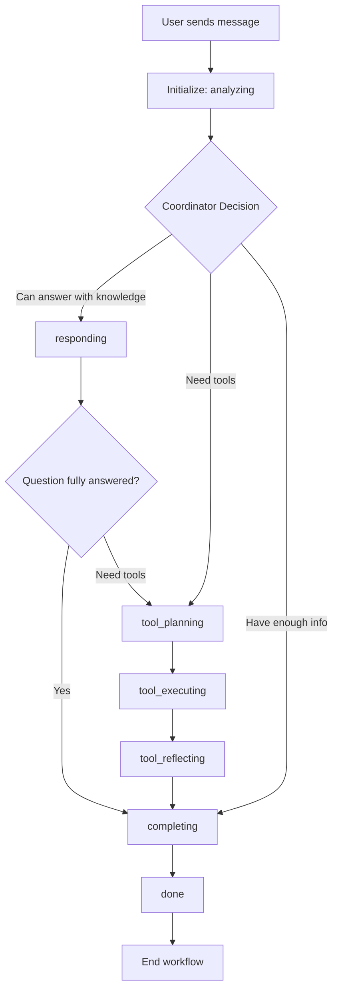

# Maps Chat Manager Workflow Coordination System

## Overview

The Maps Chat Manager uses a sophisticated **workflow-based coordinator** architecture that manages conversation flow through structured JSON states. Instead of directly calling tools, the coordinator uses a **state machine** approach with predictable transitions and clear status tracking.

## Architecture Components

### 1. **Maps Chat Manager** (`mapsChatManager.svelte.ts`)
- Main orchestrator that manages the conversation flow
- Handles user input and maintains chat state
- Tracks coordinator workflow state

### 2. **Workflow Coordinator**
- A state machine that analyzes context and determines next workflow state
- Uses structured JSON responses for predictable flow control
- Operates through defined state transitions

### 3. **Tool Execution System**
- Handles Google Maps tool calls when coordinator determines they're needed
- Executes tools based on workflow state decisions
- Integrates tool results back into the conversation

## Workflow States

The coordinator operates through these defined states:

| State | Purpose | Next States |
|-------|---------|-------------|
| `analyzing` | Initial analysis of user request | `responding`, `tool_planning`, `completing` |
| `responding` | Providing direct response with knowledge | `completing`, `tool_planning` |
| `tool_planning` | Planning to execute tools (announce what you'll do) | `tool_executing` |
| `tool_executing` | Actually executing tools | `tool_reflecting` |
| `tool_reflecting` | Reflecting on tool results | `completing` |
| `completing` | Final comprehensive response | `done` |
| `done` | Workflow complete | (end) |

## Coordinator JSON Format

The coordinator always responds with structured JSON:

```json
{
  "status": "workflow_state",
  "action": "respond|tool|complete",
  "content": "message to user",
  "toolsToExecute": ["tool1", "tool2"],
  "reflection": "analysis of results",
  "nextStep": "what happens next",
  "reasoning": "why this decision"
}
```

## Workflow Flow Diagram



## State Transition Logic

### 1. **ANALYZING** → Choose next state:
- If can answer with knowledge → `responding`
- If need tools → `tool_planning`
- If have enough info → `completing`

### 2. **RESPONDING** → Always go to:
- `completing` (if question fully answered)
- `tool_planning` (if tools needed)

### 3. **TOOL_PLANNING** → Always go to:
- `tool_executing`

### 4. **TOOL_EXECUTING** → Always go to:
- `tool_reflecting`

### 5. **TOOL_REFLECTING** → Always go to:
- `completing`

### 6. **COMPLETING** → Always go to:
- `done`

## Example Workflow Execution

**User:** "what's good pizza around here?"

### Step 1: Analyzing
```json
{
  "status": "analyzing",
  "reasoning": "Starting analysis of user request"
}
```

### Step 2: Responding
```json
{
  "status": "responding",
  "action": "respond",
  "content": "Based on the Palo Alto area, I'd recommend Tony's Little Star Pizza for deep dish or Pizzeria Delfina for Neapolitan style. Would you like me to search for current pizza places on the map?",
  "reasoning": "Can provide knowledge-based recommendations first"
}
```

### Step 3: Tool Planning (if user says "yes search")
```json
{
  "status": "tool_planning",
  "action": "respond",
  "content": "I'll search for pizza places in your area right now!",
  "toolsToExecute": ["search_maps"],
  "reasoning": "User requested map search"
}
```

### Step 4: Tool Executing
```json
{
  "status": "tool_executing",
  "reasoning": "Execute the planned tools"
}
```

### Step 5: Tool Reflecting
```json
{
  "status": "tool_reflecting",
  "reasoning": "Need to reflect on tool results"
}
```

### Step 6: Completing
```json
{
  "status": "completing",
  "action": "complete",
  "content": "Perfect! I found several great pizza options. Based on the search results, Tony's Little Star Pizza shows up with 4.2 stars and Pizzeria Delfina has excellent reviews. Both are within your area. Would you like directions to either?",
  "reasoning": "Comprehensive response with tool results and knowledge"
}
```

### Step 7: Done
```json
{
  "status": "done",
  "reasoning": "Workflow complete"
}
```

## Key Features

### 1. **Predictable State Machine**
- Clear state transitions with defined rules
- No infinite loops or unpredictable behavior
- Each state has a specific purpose and next steps

### 2. **Structured JSON Control**
- All coordinator decisions are in parseable JSON format
- Status tracking enables workflow monitoring
- Reasoning field provides transparency

### 3. **Guaranteed Tool Reflection**
- Tool execution MUST be followed by reflection
- Reflection MUST be followed by completion
- Never skip the reflection step after tools

### 4. **Workflow Visibility**
- Coordinator state is exposed for monitoring
- Clear status tracking throughout the process
- Reasoning provided for each decision

### 5. **Fallback Protection**
- Maximum iteration limit prevents infinite loops
- Graceful degradation when things go wrong
- Error handling at each step

## Benefits of Workflow Architecture

1. **Predictable Behavior**: State machine ensures consistent flow
2. **Debuggable**: Clear state transitions and reasoning
3. **Controllable**: JSON statuses can be parsed and modified
4. **Testable**: Each state can be tested independently
5. **Maintainable**: Clear separation of concerns
6. **Extensible**: New states can be added easily

## Implementation Details

### Coordinator State Interface
```typescript
interface CoordinatorState {
  status: 'analyzing' | 'responding' | 'tool_planning' | 'tool_executing' | 'tool_reflecting' | 'completing' | 'done';
  action?: 'respond' | 'tool' | 'complete';
  content?: string;
  toolsToExecute?: string[];
  reflection?: string;
  nextStep?: string;
  reasoning?: string;
}
```

### Workflow Execution
```typescript
// Execute a workflow step based on the coordinator state
private async executeWorkflowStep(
  state: CoordinatorState, 
  url: string, 
  userMessage: string, 
  mapsContext: string, 
  onSuccess?: () => void
): Promise<boolean> {
  
  switch (state.status) {
    case 'responding':
      // Add response to chat
      return true; // Continue workflow
      
    case 'tool_executing':
      // Execute tools
      // Update state to 'tool_reflecting'
      return true; // Continue to reflection
      
    case 'completing':
      // Add final response
      return false; // End workflow
      
    // ... other cases
  }
}
```

## Configuration

### Models Used
- **Workflow Coordinator**: `meta-llama/llama-4-maverick-17b-128e-instruct` (temperature: 0.1)
- **Tool Execution**: `meta-llama/llama-4-maverick-17b-128e-instruct` (temperature: 0.3)

### Safety Limits
- Maximum 5 iterations per workflow
- Timeout protection on all API calls
- Error handling and graceful degradation
- Fallback responses when limits reached

## Critical Rules

1. **Always include "reasoning" field** - Provides transparency
2. **Tool execution MUST be followed by reflection** - Ensures user feedback
3. **Reflection MUST be followed by completion** - Proper workflow closure
4. **Never skip the reflection step after tools** - Guaranteed user communication
5. **Always provide helpful content when status requires it** - User experience focused 